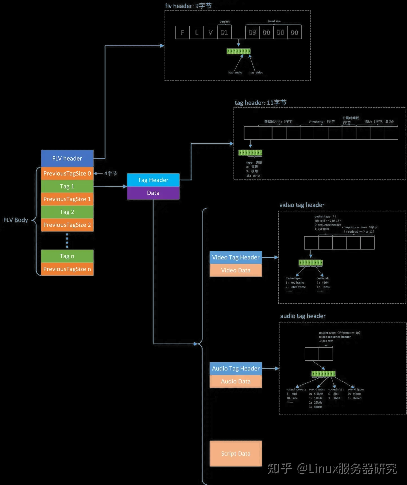

## reference:

- [Flv-streamer-2-file](https://github.com/coreyauger/flv-streamer-2-file)

- [BililiveRecorder.Flv](https://github.com/BililiveRecorder/BililiveRecorder/tree/dev/BililiveRecorder.Flv)

- [C# AMF library](https://github.com/liuyunxiong/rtmpsharp/tree/master/src/IO)

- [blog : 流媒体协议-http-flv.md](https://github.com/feizhufanfan/blog/blob/a24e1550a610b431ea4626306772fffc04413551/source/_posts/%E6%B5%81%E5%AA%92%E4%BD%93%E5%8D%8F%E8%AE%AE-http-flv.md)

- [blog : FLV文件格式解析](https://xieyugui.wordpress.com/2015/11/25/flv%E6%96%87%E4%BB%B6%E6%A0%BC%E5%BC%8F%E8%A7%A3%E6%9E%90/)




## FLV tools:

- [Thumbcoil: Tools for inspecting MPEG2TS, fMP4, and FLV files and the codec bitstreams therein](https://github.com/videojs/thumbcoil)

- [FlvInspector: A tool for parsing flv files online](https://github.com/tyrese-yang/FlvInspector/tree/master)

- [flvtool2](https://github.com/unnu/flvtool2)

- [Flvmeta: FLV Metadata Editor](https://github.com/noirotm/flvmeta)


## How to use

see TestSaveFlv.java

```java
String in=..., out=...;;

FlvSaver stream2File = new FlvSaver(out);

stream2File.SaveMetaInterval = 1000 * 60;

FileInputStream fs = new FileInputStream(in);

int BUF_LEN = 4096;
byte[] buffer = new byte[BUF_LEN];

int read = 0;
while((read=fs.read(buffer)) > 0) {
	stream2File.Write(buffer, 0, read);
}
stream2File.PanallizeFile();

stream2File.close();
fs.close();
```

Simple, Java is best !